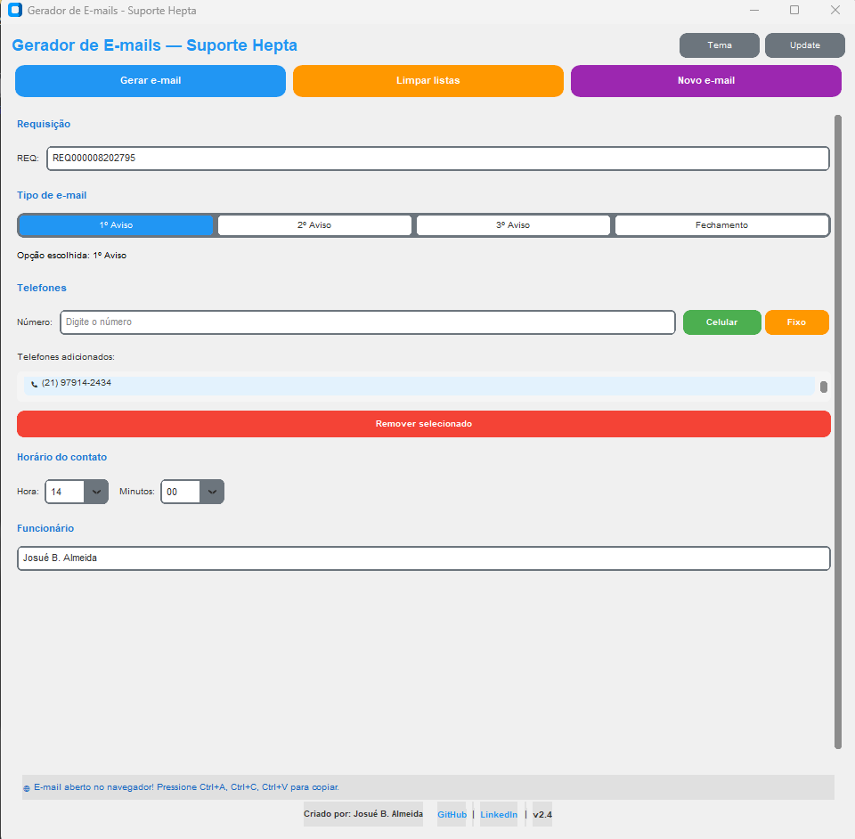
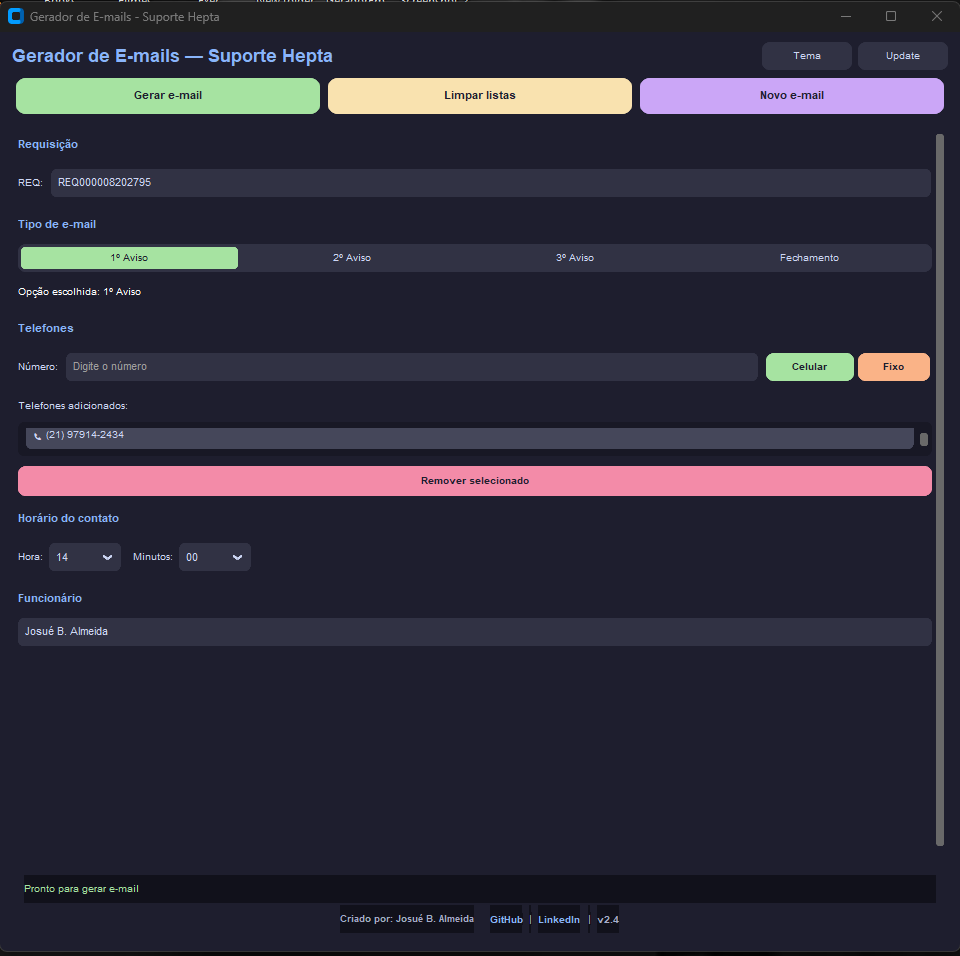

# 📧 Gerador de E-mails - Suporte Hepta

## Ferramenta Desktop para Automação de Comunicação com Clientes

**Agilize o atendimento, padronize mensagens e ganhe produtividade** com um gerador de e-mails inteligente para equipes de suporte técnico.

## 🖥️ **Demonstração**

<div align="center">

| Modo Claro | Modo Escuro |
|:----------:|:-----------:|
|  |  |

*Interface gráfica do Gerador de E-mails - Modo claro (esquerda) e Modo escuro (direita)*

</div>
---

[](LICENSE)
[](https://www.microsoft.com/windows)
[](https://python.org)
[](https://pyinstaller.org)
[](https://docs.python.org/3/library/tkinter.html)
[](tests/)
[](https://github.com/Joshpcbrrj/gerador-email-hepta)
[](https://github.com/Joshpcbrrj/gerador-email-hepta)
[](https://github.com/Joshpcbrrj/gerador-email-hepta/releases/latest)

---

**🚀 [Baixar Executável](https://github.com/Joshpcbrrj/gerador-email-hepta/releases)**

</div>

---

## ✨ Funcionalidades

### 📝 **Geração de E-mails Inteligente**

- 🏷️ **Três tipos de aviso** - 1º, 2º e 3º tentativa de contato com cliente
- 🔒 **E-mail de fechamento** - Comunicação automática após 3 tentativas sem sucesso
- 📅 **Data e hora personalizáveis** - Registro preciso da tentativa de contato

### 📞 **Gestão de Contatos**

- 📱 **Múltiplos telefones** - Suporte a vários números por cliente
- 🔢 **Formatação automática** - Padrão brasileiro (XX) XXXXX-XXXX
- ✅ **Validação inteligente** - Aceita números com ou sem formatação

### 🖼️ **E-mails Visuais**

- 🖼️ **Imagens embutidas** - Logo da empresa e instruções WinVNC
- 📄 **HTML profissional** - E-mails formatados com CSS
- 🌐 **Preview no navegador** - Visualize antes de enviar

### 🎨 **Interface Moderna**

- 📱 **Totalmente responsiva** - Janela redimensionável
- 🎯 **Botões intuitivos** - Gerar, Limpar, Novo E-mail
- 📋 **Área de preview** - Acompanhe o que foi gerado
- 🌙 **Scroll suave** - Suporte a telas de qualquer tamanho

### 🚀 **Produtividade**

- ⚡ **Geração instantânea** - E-mail pronto em segundos
- 📋 **Cópia simples** - Ctrl+A, Ctrl+C, Ctrl+V no navegador
- 💾 **Arquivos organizados** - Salvos automaticamente como HTML
- 🔄 **Multipla execução** - Gere quantos e-mails precisar

---

## 🛠️ **Tecnologias Utilizadas**

### Core & Linguagem

| Tecnologia       | Versão | Finalidade                        |
|------------------|--------|-----------------------------------|
| **Python**       | 3.13   | Lógica principal do programa      |
| **Tkinter**      | -      | Interface gráfica nativa          |
| **HTML5/CSS3**   | -      | Formatação dos e-mails            |

### Bibliotecas Específicas

| Tecnologia       | Versão | Finalidade                        |
|------------------|--------|-----------------------------------|
| **ReportLab**    | 4.5    | Geração de PDF (opcional)         |
| **Pillow**       | 12.2   | Manipulação de imagens            |
| **PyInstaller**  | 6.20   | Criação do executável             |
| **Base64**       | -      | Embutir imagens nos e-mails       |

### Ferramentas de Desenvolvimento

| Tecnologia     | Versão | Finalidade                    |
|----------------|--------|-------------------------------|
| **VS Code**    | -      | IDE de desenvolvimento        |
| **Git**        | -      | Controle de versão            |
| **GitHub**     | -      | Hospedagem do código          |

---

## 📊 **Status do Projeto**

| Métrica            | Status                                    |
|--------------------|-------------------------------------------|
| 🟢 **Build**       | Sucesso                                   |
| 🟢 **Executável**  | Versão 2.3                                |
| 🟢 **Interface**   | 100% funcional                            |
| 🟢 **Responsivo**  | ✅ Janela redimensionável                 |
| 🟢 **Portável**    | ✅ Único arquivo .exe                     |

---

## 📁 **Estrutura do Projeto**

O projeto segue uma arquitetura modular e organizada por responsabilidades:

<details>
<summary><b>📂 Clique para expandir a estrutura completa</b></summary>

```
gerador-email-hepta/
│
├── 🎯 Arquivos Principais
│   ├── 📄 main_gui.py           # Interface gráfica (Tkinter)
│   ├── 📄 main.py               # Versão terminal
│   └── 📄 gerador_completo.py   # Versão unificada
│
├── 🧩 Módulos do Sistema
│   ├── 📄 utils.py              # Funções utilitárias
│   ├── 📄 telefones.py          # Formatação de telefones
│   ├── 📄 imagens.py            # Manipulação de imagens (base64)
│   ├── 📄 email_html.py         # Geração HTML dos e-mails
│   ├── 📄 email_aviso.py        # Wrapper do e-mail de aviso
│   ├── 📄 email_fechamento.py   # Wrapper do e-mail de fechamento
│   ├── 📄 eventos.py            # Eventos da interface
│   ├── 📄 geracao_email.py      # Geração e salvamento
│   ├── 📄 atualizacao.py        # Auto-update
│   ├── 📄 temas.py              # Cores dos temas
│   ├── 📄 tema_manager.py       # Gerenciador de temas
│   ├── 📄 widgets.py            # Widgets da interface
│   └── 📄 widget_helpers.py     # Helpers para widgets
│
├── 🖼️ Assets
│   ├── 🖼️ winvnc.png            # Imagem da janela do WinVNC
│   └── 🖼️ logo.png              # Logo da empresa Hepta
│
├── 📸 Screenshots
│   ├── 🖼️ tela_claro.png        # Captura do modo claro
│   └── 🖼️ tela_escuro.png       # Captura do modo escuro
│
├── 🧪 Testes
│   └── 📁 tests/                # 74 testes unitários
│
├── 🔧 Configurações
│   ├── 📄 .gitignore            # Arquivos ignorados pelo Git
│   ├── 📄 LICENSE               # Licença MIT
│   └── 📄 pytest.ini            # Configuração do pytest
│
└── 📚 Documentação
    └── 📄 README.md             # Documentação do projeto
```

</details>

<br>

> **Nota:** Arquivos gerados pelo programa (`dist/`, `build/`, `*.spec`, `__pycache__/`, `email_*.html`, `*.pdf`) são ignorados pelo Git e NÃO fazem parte do repositório.

---

## 🚀 **Como Executar o Projeto**

### 📋 **Pré-requisitos**

Antes de começar, você vai precisar ter instalado em sua máquina:

| Requisito | Versão | Onde obter |
|-----------|--------|------------|
| 🐍 **Python** | 3.13 ou superior | [python.org](https://python.org) |
| 📦 **pip** | Última versão | Já vem com o Python |
| 🖥️ **Windows** | 10 ou 11 | - |

> 💡 **Dica:** Para verificar se o Python está instalado corretamente, abra o terminal e execute:
> ```bash
> python --version  # Deve mostrar Python 3.13.x ou superior
> pip --version     # Deve mostrar a versão do pip
> ```

---

### 📥 **Instalação e Execução**

<details>
<summary><b>🐍 Passo a passo para desenvolvedores</b> (Clique para expandir)</summary>

#### 1️⃣ **Clone ou baixe o projeto**

**Opção A - Clonar com Git (recomendado):**
```bash
git clone https://github.com/Joshpcbrrj/gerador-email-hepta.git
cd gerador-email-hepta
```

**Opção B - Baixar como ZIP:**
1. Acesse https://github.com/Joshpcbrrj/gerador-email-hepta
2. Clique em "Code" → "Download ZIP"
3. Extraia a pasta e acesse pelo terminal

#### 2️⃣ **Instale as dependências**

```bash
pip install reportlab pillow pyinstaller
```

⏱️ Este processo pode levar alguns minutos na primeira vez.

#### 3️⃣ **Execute o programa**

**Modo Gráfico (recomendado):**
```bash
python main_gui.py
```

**Modo Terminal (clássico):**
```bash
python main.py
```

**Modo Unificado (tudo em um arquivo):**
```bash
python gerador_completo.py
```

</details>

**🎯 Métodos Alternativos (sem Python)**

<details>
<summary><b>📦 Métodos para quem não quer instalar Python</b> (Clique para expandir)</summary>

#### **Opção 1 - Baixar o executável (recomendado)**
1. Acesse a página de [Releases](https://github.com/Joshpcbrrj/gerador-email-hepta/releases)
2. Baixe o arquivo `GeradorEmailHepta.exe`
3. Clique duas vezes para executar
4. ✅ Sem necessidade de instalação!

#### **Opção 2 - Compilar você mesmo**
```bash
pyinstaller -F --noconsole --name "GeradorEmailHepta" --add-data "winvnc.png;." --add-data "logo.png;." main_gui.py
```

</details>

### 🔧 **Comandos Úteis**

| Comando | Descrição |
|---------|-----------|
| `python main_gui.py` | Executa a versão com interface gráfica |
| `python main.py` | Executa a versão de terminal |
| `pip install reportlab pillow pyinstaller` | Instala as dependências |
| `pyinstaller -F --noconsole --name "GeradorEmailHepta" --add-data "winvnc.png;." --add-data "logo.png;." main_gui.py` | Gera o executável |

### 🐛 **Solução de Problemas Comuns**

<details>
<summary><b>⚠️ Problemas e soluções</b> (Clique para expandir)</summary>

#### **Erro: `python não é reconhecido`**
- **Problema:** Python não está no PATH do Windows
- **Solução:** 
  1. Reinstale o Python marcando a opção **"Add Python to PATH"**
  2. Ou use o executável pronto (não precisa de Python)

#### **Erro: `ModuleNotFoundError`**
- **Problema:** Bibliotecas não instaladas
- **Solução:**
  ```bash
  pip install reportlab pillow pyinstaller
  ```

#### **Imagens não aparecem no e-mail**
- **Problema:** Arquivos `winvnc.png` e `logo.png` não encontrados
- **Solução:** Coloque as imagens na mesma pasta do executável

#### **Erro ao gerar executável**
- **Problema:** PyInstaller com conflitos
- **Solução:**
  ```bash
  pip install --upgrade pyinstaller
  ```

</details>

### ✅ **Verificação de Instalação Bem-sucedida**

Após executar `python main_gui.py`, você deverá ver a janela do **Gerador de E-mails** com todos os campos disponíveis.

Preencha os dados, clique em "Gerar E-mail" e o navegador abrirá com o e-mail formatado! 🎉

---

## 🖥️ **Como Usar o Programa**

### **Interface Gráfica (Recomendado)**

1. **Preencha a REQ** - Número da requisição (ex: 000008198188)
2. **Escolha o tipo** - 1º, 2º, 3º aviso ou Fechamento
3. **Adicione telefones** - Clique em "+ Adicionar" para cada número
4. **Defina o horário** - Hora e minuto da tentativa de contato
5. **Informe seu nome** - Para assinar o e-mail
6. **Clique em "GERAR E-MAIL"** - O navegador abrirá com o e-mail pronto

### **Versão Terminal (Clássica)**

1. Execute `python main.py`
2. Responda às perguntas interativamente
3. O navegador abrirá com o e-mail formatado

### **Copiar e Colar no E-mail**

1. No navegador, pressione **Ctrl+A** (seleciona tudo)
2. Pressione **Ctrl+C** (copia)
3. Vá para seu e-mail (Outlook/Gmail)
4. Pressione **Ctrl+V** (cola)

---

## 📦 **Estrutura dos E-mails Gerados**

### **E-mail de Aviso (1º, 2º, 3º tentativa)**
- Título personalizado com REQ e número da tentativa
- Informações do contato (telefones, data, hora)
- Instruções para autorização de acesso remoto
- Imagem do WinVNC com legenda
- Assinatura com logo da empresa
- Créditos do programa

### **E-mail de Fechamento**
- Título: "REQXXXXXXXX - Chamado Fechado"
- Informação sobre as 3 tentativas sem sucesso
- Aviso sobre reabertura indevida
- Explicação dos procedimentos de segurança
- Agradecimento pela compreensão

---

## 👨‍💻 **Autor**

<div align="center">

**Desenvolvido com dedicação para otimizar o atendimento ao cliente.**

---

### 📫 **Contato e Redes**

[](https://github.com/Joshpcbrrj)
[](https://www.linkedin.com/in/josualmeida/)
[](mailto:joshpcbrrj@gmail.com)

</div>

---

## 🙏 **Agradecimentos**

- 🧪 **A todos que testaram e deram feedback** — vocês são os verdadeiros QA do projeto
- 🐍 **À comunidade Python** pelo ecossistema fantástico (PyInstaller, ReportLab, Pillow)
- 👥 **Aos colegas de trabalho** que ajudaram a refinar os templates de e-mail
- 🤖 **Ao DeepSeek** pela jornada de Vibe Coding: dúvidas sanadas, interface Tkinter construída e melhorias colaborativas
- 💙 **A você, usuário** por confiar e utilizar este projeto no seu dia a dia
  
---

## 📋 **Changelog**

### Versão 2.3 (Maio/2026)

- ✨ **Novidade:** Feedback visual da opção escolhida nos avisos
- ✨ **Novidade:** Mensagens temporárias que desaparecem após 2 segundos
- ✨ **Novidade:** Links no rodapé (GitHub e LinkedIn)
- ✨ **Novidade:** Validação de limite máximo de telefones (10)
- 🐛 **Correção:** Formatação de telefones fixos (não adiciona 9)
- 🐛 **Correção:** Limpeza automática de arquivos temporários
- 🧪 **Testes:** 74 testes unitários implementados
- 🎨 **Interface:** Melhorias visuais no modo escuro
- 📱 **UX:** Botões de tema e atualização no canto superior direito

### Versão 2.2 (Maio/2026)

- 🐛 **Correção:** Telefones fixos não recebem mais o dígito 9 automaticamente
- 🎨 **Melhoria:** Interface com separação visual entre celular e fixo

## ⭐ **Contribua com o projeto**

Se este projeto te ajudou de alguma forma:

- 🔗 **Compartilhe com colegas** que trabalham com suporte técnico
- 🐛 **Reporte bugs** abrindo uma [issue](https://github.com/Joshpcbrrj/gerador-email-hepta/issues)
- ⭐ **Dê uma estrela** no repositório para ajudar na divulgação
- 💡 **Sugira melhorias** através das issues

---

## 📄 **Licença**

Este projeto está sob a licença MIT. Consulte o arquivo [LICENSE](LICENSE) para mais informações.

---

<div align="center">

**Feito com 🐍 e Python**

</div>